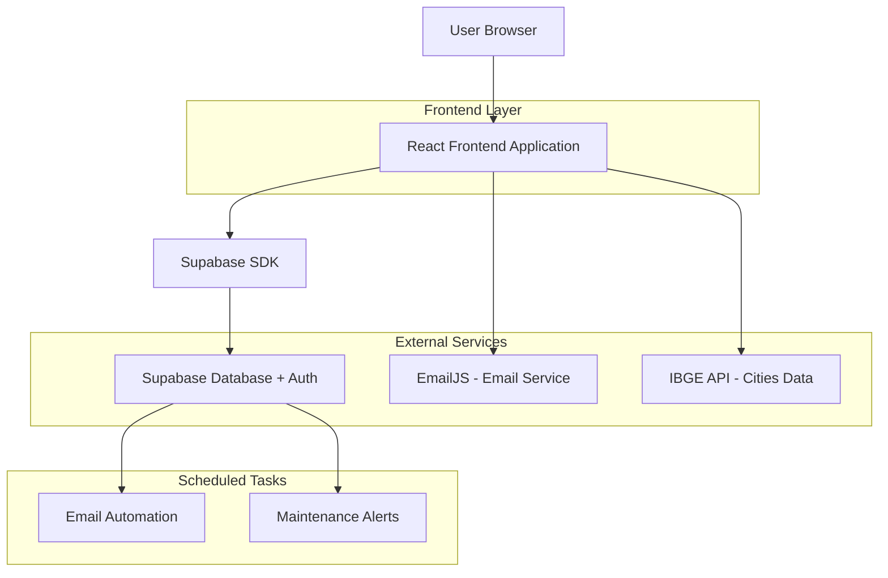
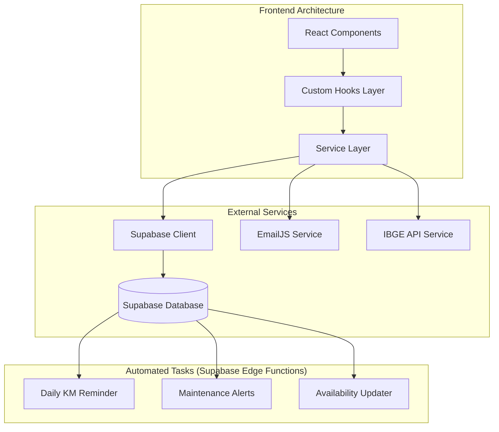
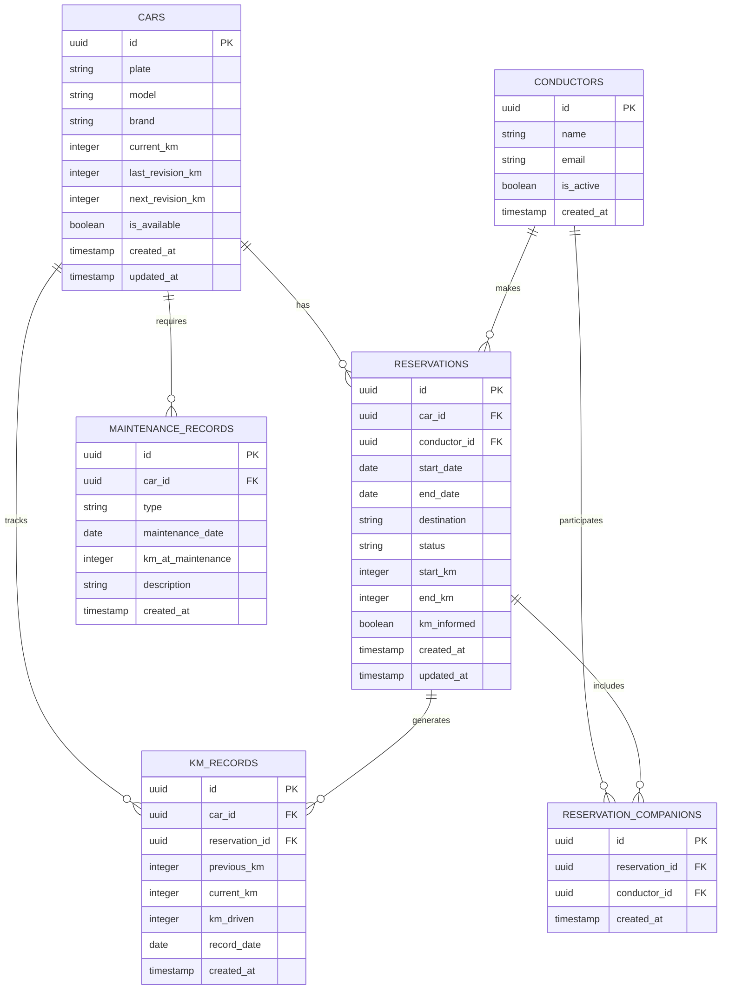

# Arquitetura Técnica - Sistema de Reservas de Carros Empresariais

## 1. Architecture design



## 2. Technology Description

* Frontend: React\@18 + TypeScript + TailwindCSS\@3 + Vite

* Backend: Supabase (PostgreSQL + Real-time + Auth)

* Email Service: EmailJS (client-side email sending)

* External APIs: IBGE Cities API

* Deployment: Vercel (frontend) + Supabase Cloud

## 3. Route definitions

| Route             | Purpose                                            |
| ----------------- | -------------------------------------------------- |
| /                 | Página inicial com formulário de nova reserva      |
| /dashboard        | Dashboard com todas as reservas e filtros          |
| /finalizar-viagem | Formulário para informar quilometragem pós-viagem  |
| /admin            | Painel administrativo para controle de manutenção  |
| /status           | Visualização de pendências e disponibilidade atual |
| /reserva/:id      | Detalhes específicos de uma reserva                |

## 4. API definitions

### 4.1 Core API

**Busca de Cidades (IBGE)**

```
GET https://servicodados.ibge.gov.br/api/v1/localidades/municipios
```

Response:

| Param Name   | Param Type | Description           |
| ------------ | ---------- | --------------------- |
| id           | number     | ID único do município |
| nome         | string     | Nome da cidade        |
| microrregiao | object     | Dados da microrregião |
| mesorregiao  | object     | Dados da mesorregião  |
| UF           | object     | Dados do estado       |

**Email Service (EmailJS)**

```
POST https://api.emailjs.com/api/v1.0/email/send
```

Request:

| Param Name       | Param Type | isRequired | Description              |
| ---------------- | ---------- | ---------- | ------------------------ |
| service\_id      | string     | true       | ID do serviço EmailJS    |
| template\_id     | string     | true       | ID do template de e-mail |
| user\_id         | string     | true       | Chave pública EmailJS    |
| template\_params | object     | true       | Parâmetros do template   |

### 4.2 Supabase Functions

**Verificação de Disponibilidade**

```sql
CREATE OR REPLACE FUNCTION check_car_availability(
    car_id TEXT,
    start_date DATE,
    end_date DATE
) RETURNS BOOLEAN
```

**Cálculo de Próxima Revisão**

```sql
CREATE OR REPLACE FUNCTION calculate_next_revision(
    car_id TEXT
) RETURNS INTEGER
```

## 5. Server architecture diagram



## 6. Data model

### 6.1 Data model definition



### 6.2 Data Definition Language

**Cars Table (cars)**

```sql
-- Create cars table
CREATE TABLE cars (
    id UUID PRIMARY KEY DEFAULT gen_random_uuid(),
    plate VARCHAR(10) UNIQUE NOT NULL,
    model VARCHAR(50) NOT NULL DEFAULT 'T-Cross',
    brand VARCHAR(50) NOT NULL DEFAULT 'Volkswagen',
    current_km INTEGER NOT NULL DEFAULT 0,
    last_revision_km INTEGER NOT NULL DEFAULT 0,
    next_revision_km INTEGER NOT NULL DEFAULT 10000,
    is_available BOOLEAN DEFAULT true,
    created_at TIMESTAMP WITH TIME ZONE DEFAULT NOW(),
    updated_at TIMESTAMP WITH TIME ZONE DEFAULT NOW()
);

-- Create index
CREATE INDEX idx_cars_plate ON cars(plate);
CREATE INDEX idx_cars_availability ON cars(is_available);

-- Insert initial data
INSERT INTO cars (plate, current_km, last_revision_km, next_revision_km) VALUES
('TMA3I25', 45000, 40000, 50000),
('TMB1H54', 32000, 30000, 40000);
```

**Conductors Table (conductors)**

```sql
-- Create conductors table
CREATE TABLE conductors (
    id UUID PRIMARY KEY DEFAULT gen_random_uuid(),
    name VARCHAR(100) NOT NULL,
    email VARCHAR(255) UNIQUE NOT NULL,
    is_active BOOLEAN DEFAULT true,
    created_at TIMESTAMP WITH TIME ZONE DEFAULT NOW()
);

-- Create index
CREATE INDEX idx_conductors_email ON conductors(email);
CREATE INDEX idx_conductors_active ON conductors(is_active);

-- Insert initial data
INSERT INTO conductors (name, email) VALUES
('Paulo H.', 'paulo.henrique@grupopluma.com.br'),
('Eduardo S.', 'eduardo.sawasaki@grupopluma.com.br'),
('Maycon A.', 'maycon.azevedo@grupopluma.com.br'),
('Guilherme T.', 'guilherme.tamanho@grupopluma.com.br'),
('Rejeane M.', 'rejeane.mezzalira@grupopluma.com.br'),
('Ayeska A.', 'aryanne.andrade@grupopluma.com.br'),
('Francisco S.', 'francisco.santos@grupopluma.com.br'),
('Joao C.', 'joao.marcos@grupopluma.com.br'),
('Martielo O.', 'martielo.oliveira@grupopluma.com.br'),
('Gustavo C.', 'gustavo.camargo@plumaagro.com.br');
```

**Reservations Table (reservations)**

```sql
-- Create reservations table
CREATE TABLE reservations (
    id UUID PRIMARY KEY DEFAULT gen_random_uuid(),
    car_id UUID NOT NULL REFERENCES cars(id),
    conductor_id UUID NOT NULL REFERENCES conductors(id),
    start_date DATE NOT NULL,
    end_date DATE NOT NULL,
    destination VARCHAR(255) NOT NULL,
    status VARCHAR(20) DEFAULT 'confirmed' CHECK (status IN ('confirmed', 'in_progress', 'completed', 'cancelled')),
    start_km INTEGER,
    end_km INTEGER,
    km_informed BOOLEAN DEFAULT false,
    created_at TIMESTAMP WITH TIME ZONE DEFAULT NOW(),
    updated_at TIMESTAMP WITH TIME ZONE DEFAULT NOW()
);

-- Create indexes
CREATE INDEX idx_reservations_car_id ON reservations(car_id);
CREATE INDEX idx_reservations_conductor_id ON reservations(conductor_id);
CREATE INDEX idx_reservations_dates ON reservations(start_date, end_date);
CREATE INDEX idx_reservations_status ON reservations(status);
CREATE INDEX idx_reservations_km_informed ON reservations(km_informed);
```

**Reservation Companions Table (reservation\_companions)**

```sql
-- Create reservation companions table
CREATE TABLE reservation_companions (
    id UUID PRIMARY KEY DEFAULT gen_random_uuid(),
    reservation_id UUID NOT NULL REFERENCES reservations(id) ON DELETE CASCADE,
    conductor_id UUID NOT NULL REFERENCES conductors(id),
    created_at TIMESTAMP WITH TIME ZONE DEFAULT NOW(),
    UNIQUE(reservation_id, conductor_id)
);

-- Create indexes
CREATE INDEX idx_companions_reservation_id ON reservation_companions(reservation_id);
CREATE INDEX idx_companions_conductor_id ON reservation_companions(conductor_id);
```

**Maintenance Records Table (maintenance\_records)**

```sql
-- Create maintenance records table
CREATE TABLE maintenance_records (
    id UUID PRIMARY KEY DEFAULT gen_random_uuid(),
    car_id UUID NOT NULL REFERENCES cars(id),
    type VARCHAR(50) NOT NULL CHECK (type IN ('washing', 'revision', 'repair', 'other')),
    maintenance_date DATE NOT NULL,
    km_at_maintenance INTEGER NOT NULL,
    description TEXT,
    created_at TIMESTAMP WITH TIME ZONE DEFAULT NOW()
);

-- Create indexes
CREATE INDEX idx_maintenance_car_id ON maintenance_records(car_id);
CREATE INDEX idx_maintenance_date ON maintenance_records(maintenance_date);
CREATE INDEX idx_maintenance_type ON maintenance_records(type);
```

**KM Records Table (km\_records)**

```sql
-- Create km records table
CREATE TABLE km_records (
    id UUID PRIMARY KEY DEFAULT gen_random_uuid(),
    car_id UUID NOT NULL REFERENCES cars(id),
    reservation_id UUID REFERENCES reservations(id),
    previous_km INTEGER NOT NULL,
    current_km INTEGER NOT NULL,
    km_driven INTEGER GENERATED ALWAYS AS (current_km - previous_km) STORED,
    record_date DATE NOT NULL DEFAULT CURRENT_DATE,
    created_at TIMESTAMP WITH TIME ZONE DEFAULT NOW()
);

-- Create indexes
CREATE INDEX idx_km_records_car_id ON km_records(car_id);
CREATE INDEX idx_km_records_reservation_id ON km_records(reservation_id);
CREATE INDEX idx_km_records_date ON km_records(record_date);
```

**Row Level Security (RLS) Policies**

```sql
-- Enable RLS
ALTER TABLE cars ENABLE ROW LEVEL SECURITY;
ALTER TABLE conductors ENABLE ROW LEVEL SECURITY;
ALTER TABLE reservations ENABLE ROW LEVEL SECURITY;
ALTER TABLE reservation_companions ENABLE ROW LEVEL SECURITY;
ALTER TABLE maintenance_records ENABLE ROW LEVEL SECURITY;
ALTER TABLE km_records ENABLE ROW LEVEL SECURITY;

-- Grant permissions to anon role (read-only)
GRANT SELECT ON ALL TABLES IN SCHEMA public TO anon;

-- Grant full permissions to authenticated role
GRANT ALL PRIVILEGES ON ALL TABLES IN SCHEMA public TO authenticated;
GRANT USAGE, SELECT ON ALL SEQUENCES IN SCHEMA public TO authenticated;
```

**Supabase Edge Functions for Automation**

```sql
-- Function to check car availability
CREATE OR REPLACE FUNCTION check_car_availability(
    p_car_id UUID,
    p_start_date DATE,
    p_end_date DATE
) RETURNS BOOLEAN AS $$
BEGIN
    -- Check if car exists and is available
    IF NOT EXISTS (SELECT 1 FROM cars WHERE id = p_car_id AND is_available = true) THEN
        RETURN false;
    END IF;
    
    -- Check for overlapping reservations
    IF EXISTS (
        SELECT 1 FROM reservations 
        WHERE car_id = p_car_id 
        AND status IN ('confirmed', 'in_progress')
        AND (
            (start_date <= p_end_date AND end_date >= p_start_date)
            OR (end_date + INTERVAL '2 days' >= p_start_date AND end_date <= p_end_date)
        )
    ) THEN
        RETURN false;
    END IF;
    
    RETURN true;
END;
$$ LANGUAGE plpgsql;

-- Function to update car availability after trip
CREATE OR REPLACE FUNCTION update_car_post_trip()
RETURNS TRIGGER AS $$
BEGIN
    -- When km is informed, make car unavailable for 2 days
    IF NEW.km_informed = true AND OLD.km_informed = false THEN
        UPDATE cars 
        SET is_available = false 
        WHERE id = NEW.car_id;
        
        -- Schedule to make available again after 2 days
        -- This would be handled by a scheduled function
    END IF;
    
    RETURN NEW;
END;
$$ LANGUAGE plpgsql;

-- Create trigger
CREATE TRIGGER trigger_update_car_post_trip
    AFTER UPDATE ON reservations
    FOR EACH ROW
    EXECUTE FUNCTION update_car_post_trip();
```

