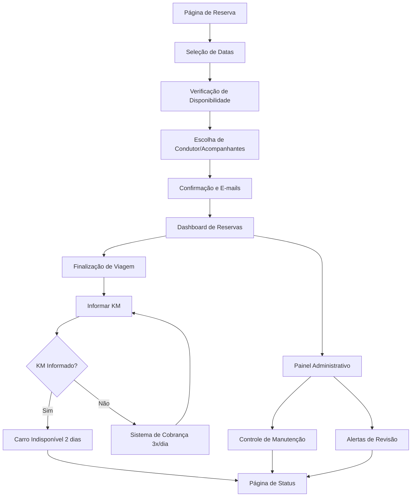

# Sistema de Reservas de Carros Empresariais - Grupo Pluma

## 1. Product Overview

Sistema de reservas de carros empresariais para gerenciar 2 veículos T-Cross da frota do Grupo Pluma, sem necessidade de login e com controle automatizado de disponibilidade, manutenção e quilometragem.

O sistema resolve o problema de agendamento manual de veículos corporativos, oferecendo controle automatizado de disponibilidade, notificações por e-mail e gestão de manutenção preventiva para uma equipe de 10 condutores autorizados.

Objetivo: Otimizar o uso da frota empresarial com zero custo operacional e interface simplificada para uso interno.

## 2. Core Features

### 2.1 User Roles

| Role | Registration Method | Core Permissions |
|------|---------------------|------------------|
| Condutor Autorizado | Seleção em lista pré-definida | Pode criar reservas, informar KM, visualizar histórico próprio |
| Acompanhante | Seleção em lista pré-definida | Recebe notificações de reservas onde foi incluído |
| Administrador | Acesso direto ao painel | Visualiza todas as reservas, gerencia manutenção, exporta relatórios |

### 2.2 Feature Module

Nosso sistema de reservas empresariais consiste nas seguintes páginas principais:

1. **Página de Reserva**: formulário de nova reserva, seleção de datas, escolha de condutor e acompanhantes, verificação de disponibilidade em tempo real.
2. **Dashboard de Reservas**: visualização de todas as reservas, filtros por condutor/carro/destino/datas, status de disponibilidade dos veículos.
3. **Página de Finalização de Viagem**: formulário para informar quilometragem, upload de comprovantes, confirmação de devolução.
4. **Painel Administrativo**: controle de manutenção, histórico de quilometragem, alertas de revisão, exportação de relatórios.
5. **Página de Status**: visualização de pendências de KM, próximas revisões, disponibilidade atual dos carros.

### 2.3 Page Details

| Page Name | Module Name | Feature description |
|-----------|-------------|---------------------|
| Página de Reserva | Formulário de Reserva | Selecionar datas de retirada/devolução, destino com autocomplete, condutor principal da lista pré-definida |
| Página de Reserva | Seleção de Acompanhantes | Escolher múltiplos acompanhantes da lista, visualizar e-mails que receberão confirmação |
| Página de Reserva | Verificação de Disponibilidade | Mostrar apenas carros disponíveis para o período, aplicar regra de 2 dias pós-retorno |
| Dashboard de Reservas | Lista de Reservas | Exibir todas as reservas com status, permitir filtros por condutor/carro/destino/período |
| Dashboard de Reservas | Calendário de Ocupação | Visualização em calendário da ocupação dos 2 T-Cross (TMA3I25 e TMB1H54) |
| Dashboard de Reservas | Exportação de Dados | Gerar relatórios em Excel/CSV com filtros aplicados |
| Finalização de Viagem | Informar Quilometragem | Campo obrigatório para KM final, cálculo automático de KM rodados |
| Finalização de Viagem | Sistema de Cobrança | Enviar 3 e-mails diários automáticos até informar KM, alertar em novas reservas |
| Painel Administrativo | Controle de Manutenção | Registrar lavagem/manutenção, definir períodos de indisponibilidade |
| Painel Administrativo | Alertas de Revisão | Monitorar quilometragem total, alertar próximo aos 10.000km de revisão |
| Página de Status | Pendências Ativas | Listar condutores com KM pendente, próximas manutenções programadas |
| Página de Status | Disponibilidade Atual | Status em tempo real dos 2 carros, próximas reservas confirmadas |

## 3. Core Process

**Fluxo Principal de Reserva:**
1. Condutor acessa página de reserva sem login
2. Seleciona datas de retirada e devolução
3. Sistema verifica disponibilidade aplicando regra de 2 dias pós-retorno
4. Escolhe destino com autocomplete de cidades brasileiras
5. Seleciona condutor principal e acompanhantes da lista pré-definida
6. Sistema mostra apenas carros disponíveis para o período
7. Confirma reserva e envia e-mails automáticos para todos os envolvidos

**Fluxo de Finalização de Viagem:**
1. Condutor acessa página de finalização após retorno
2. Informa quilometragem final obrigatória
3. Sistema calcula KM rodados e atualiza histórico
4. Carro fica automaticamente indisponível por 2 dias
5. Se KM não informado, sistema inicia cobrança automática (3x/dia)

**Fluxo Administrativo:**
1. Administrador monitora dashboard com todas as reservas
2. Recebe alertas automáticos de revisão próxima (10.000km)
3. Gerencia períodos de manutenção manual
4. Exporta relatórios filtrados para análise

## 4. User Interface Design

### 4.1 Design Style

- **Cores primárias**: Azul corporativo (#2563EB), Verde confirmação (#10B981)
- **Cores secundárias**: Cinza neutro (#6B7280), Vermelho alerta (#EF4444)
- **Estilo de botões**: Arredondados com sombra sutil, hover com transição suave
- **Fonte**: Inter ou Roboto, tamanhos 14px (corpo), 18px (títulos), 24px (cabeçalhos)
- **Layout**: Design limpo tipo card, navegação superior fixa, sidebar para filtros
- **Ícones**: Feather Icons ou Heroicons, estilo outline para consistência

### 4.2 Page Design Overview

| Page Name | Module Name | UI Elements |
|-----------|-------------|-------------|
| Página de Reserva | Formulário Principal | Cards brancos com sombra, campos com labels flutuantes, date picker customizado, dropdown de condutores com busca |
| Página de Reserva | Verificação Disponibilidade | Cards dos carros com status visual (verde=disponível, vermelho=ocupado, amarelo=manutenção), badges com placas |
| Dashboard de Reservas | Lista de Reservas | Tabela responsiva com paginação, filtros em sidebar colapsável, badges coloridos para status |
| Dashboard de Reservas | Calendário | Grid mensal com cores por carro, tooltips com detalhes da reserva, navegação mês/ano |
| Finalização de Viagem | Formulário KM | Input numérico destacado, botão de confirmação proeminente, alertas visuais para pendências |
| Painel Administrativo | Controle Geral | Dashboard com cards de métricas, gráficos de utilização, alertas em destaque no topo |

### 4.3 Responsiveness

Sistema desktop-first com adaptação mobile completa. Interface otimizada para tablets em modo paisagem para uso em campo. Navegação touch-friendly com botões de tamanho adequado (min 44px) e gestos de swipe para calendário.